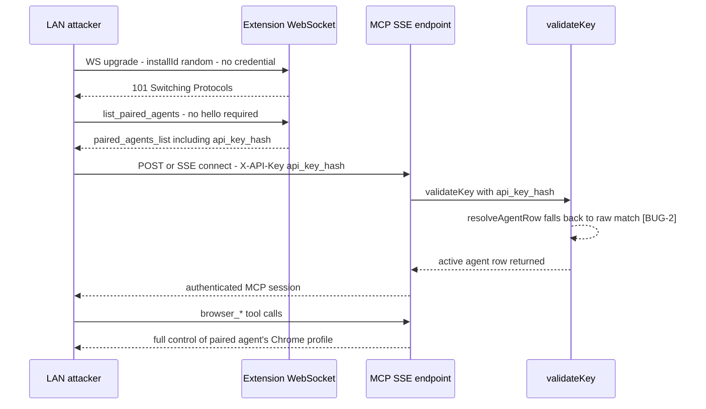
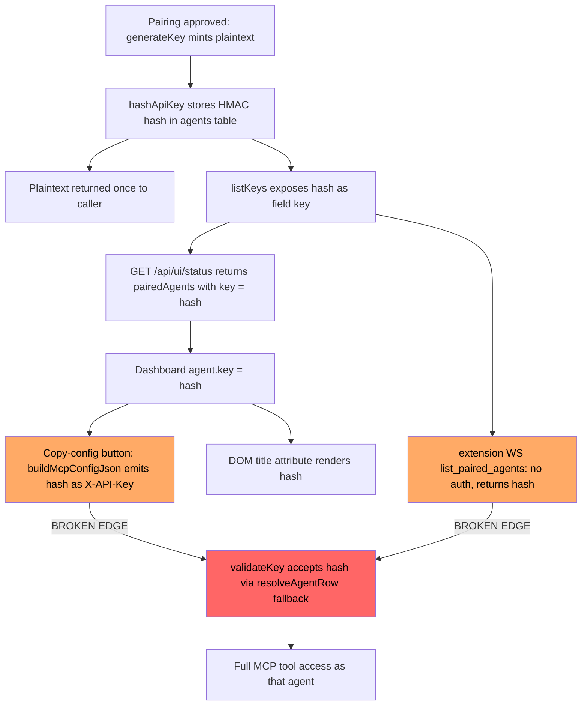
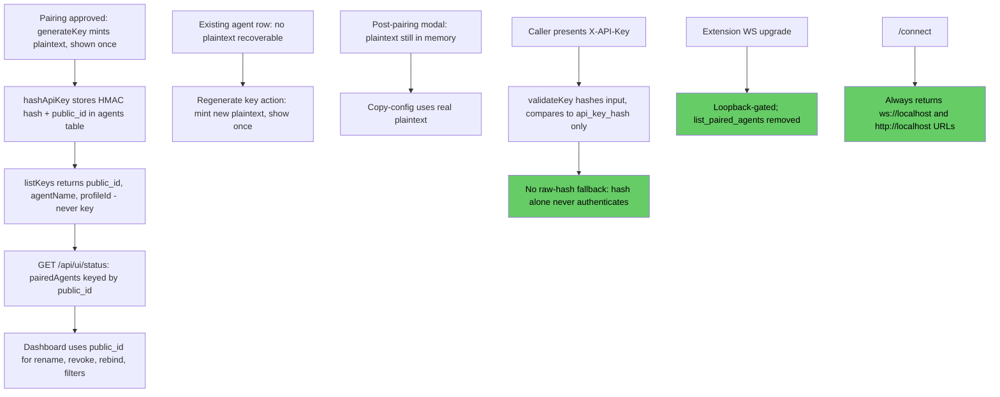

# Agent Key & Connection Trust — Findings and Fix Plan

## 1. Summary

The paired-agent API key is a hash-as-credential design flaw compounded by a WS
surface that leaks that hash to any LAN-reachable client with no authentication.
Chained together (`C2` → `C3` → `C5`), any device on the same network as the
user's machine when **network mode** is enabled can enumerate every paired
agent's `api_key_hash` over the unauthenticated extension WebSocket, then
present that hash as `X-API-Key` on `/sse` and pass `validateKey` — full,
unattenuated control of every WebPilot tool (`browser_*`, `webpilot_run_workflow`,
etc.) for every paired agent, on the real Chrome profile. Network mode is
opt-in, but once enabled the exploit requires no credential, no prior pairing,
and no user interaction beyond having flipped the toggle. Fixing this requires
removing the raw-hash-as-credential fallback (`BUG-2`), which is a **breaking
change**: every agent config populated by today's "copy config" button holds a
hash, not a plaintext key, so **all existing paired agents must be re-paired**
after the fix — the pepper itself is unaffected and does not need rotation.

## 2. Scope & threat model

- The server always runs on the user's own machine, colocated with Chrome and
  the WebPilot extension.
- In default mode the server binds `127.0.0.1` only; nothing here is
  network-reachable.
- In **network mode** (`--network` / `NETWORK=1` / `config.network_enabled`),
  the design intent is that *only* the MCP-agent surface (extension WS + `/sse`)
  becomes LAN-reachable, so a remote coding agent can drive the browser. The
  `/api/ui/*` REST surface and the UI events WS are meant to stay loopback-gated
  regardless of mode.
- **Accepted out of scope:** a malicious process already running as the local
  user on the same machine. That process can read the SQLite DB, the pepper
  file, and Chrome's own profile directly — no amount of server-side hardening
  changes that trust boundary.
- **In scope:** any other host reachable when network mode is on (the
  documented, "meant to be remote" case) and any local web page (Origin
  checks and hash-in-UI exposure).

## 3. Findings

| ID | Title | Severity | File:line | Impact |
|----|-------|----------|-----------|--------|
| C1 | Network mode flips the whole listener, not just the agent surface | High | `packages/server-for-chrome-extension/index.js:90-93`; `server.js:1503-1536` (UI gates), `381-439` (makeUiAuth/makeMutatingUiAuth) | Extension WS and `/api/popup/*` become LAN-reachable; `/api/ui/*` and the UI events WS correctly stay loopback-gated via remote-address checks — this part of C1 is confirmed as designed, not a bug in itself, but it's the precondition for C2–C6. |
| C2 | Extension WS upgrade requires no credential | Critical | `server.js:1564-1592` | Any non-browser client (no `http(s)` Origin) with any non-empty `installId` completes the WS upgrade. This is the entry point for the whole chain once network mode is on. |
| C3 | `list_paired_agents` requires no auth, no prior `hello` | Critical | `server.js:1802-1807` handler; `paired-keys.js:451-464` `listKeys()` | Any connected WS client can request and receive every paired agent's `agentName`, `profileId`, and `api_key_hash` (field `key`) with zero authentication. |
| C4 | Key hashing / pepper storage (baseline, no bug) | — (informational) | `paired-keys.js:180-183` `hashApiKey` (HMAC-SHA256 w/ pepper); pepper at `<dataDir>/secret/api-key.pepper`, legacy fallback `config.api_key_pepper`; plaintext returned once by `generateKey()`/`addKey` (`paired-keys.js:336`, `353-368`) and `createPairedAgent` (`373-389`) | Confirmed correct as designed — plaintext is never persisted. Not itself a vulnerability; listed because C5/C6 build on it. |
| C5 | **BUG-2**: hash accepted as a live credential | Critical | `resolveAgentRow` fallback, `paired-keys.js:295-309`; `validateKey`, `paired-keys.js:402-405`; MCP auth gate, `mcp-handler.js:914` (`pairedKeys.validateKey(effectiveKey)`) | `resolveAgentRow` hashes the input, and on miss falls back to matching the input **directly** against `api_key_hash`. A stored hash therefore authenticates as if it were the plaintext key — the one value the system guarantees is `is-a-secret` is the exact value that also `is-a-credential`. |
| C6 | UI exposes the hash as the agent identifier and feeds it to copy-config | High | `GET /api/ui/status`, `server.js:461` route / `pairedAgents: pairedKeys.listKeys()`; `AgentRow.js:44` `buildMcpConfigJson({ port, apiKey: agent.key })`; `AgentRow.js:73` (`title={agent.key}` — hash rendered into the DOM); `lib/mcpConfig.js:16-26` | The existing-agent "copy config" button emits the hash as `X-API-Key` in the generated `.mcp.json` snippet. It only produces a *working* config because of BUG-2 (C5); once BUG-2 is fixed this button silently emits garbage. The hash is also visible in a DOM `title` attribute (view-source/devtools exposure) and to any local page/extension that can read the status API surface. |
| C7 | `hello` trusts client-supplied `profileId`; no per-socket response binding | Med | `server.js:1653` (`resolvedProfileId = message.profileId \|\| null`, unvalidated on that path); `extension-bridge.js:21-43` `setConnection` (closes+replaces prior connection for a profile); `extension-bridge.js:161-180` `handleResponse` (matches only command `id`, not originating socket) | A second WS connection that sends `hello` with an attacker-chosen `profileId` (bypassing the validated `installId`/`gaiaEmail` paths) can hijack routing for that profile, displacing the legitimate extension connection; command responses aren't bound to the socket that issued them. Narrower blast radius than C2/C3/C5 but compounds the same "no credential on this WS" root cause. |
| C8 | `/connect` hands the extension a LAN address for a same-machine connection | Med | `server.js:2151-2161` `app.get('/connect', ...)`; `serverUrl`/`sseUrl` built from `publicHost`; `index.js:90-91` sets `publicHost = getLocalIP()` in network mode | The extension is always on the same machine as the server, yet in network mode it's told to dial the LAN IP instead of loopback — unnecessarily widening exposure and sharing root cause with #125 (popup dashboard link also uses the LAN IP and then hits the loopback-only `/ui` gate, breaking the link for the user on their own machine). |

Note: C4 is retained in the table as a baseline/no-bug row per the instructions ("drop/merge any that were CORRECTED to false" — C4 was not corrected, it validated true, but carries no independent severity; it is the design precondition C5 subverts).

### Docs claims — now false

| Claim | Location | Status |
|---|---|---|
| "Claiming an installId grants zero agent power." | `SECURITY.md:43` | **False.** Via C2 + C3 + C5, claiming any installId (no auth) → `list_paired_agents` → `api_key_hash` → full agent power over `/sse`. |
| "Anyone reaching the port can claim any installId. That grants no MCP tool power; agent-layer auth is the real gate." | `docs/MCP_SERVER.md:263` | **False**, same chain as above — "agent-layer auth is the real gate" is undermined by BUG-2 (C5), and the WS itself leaks the credential-equivalent value (C3) before agent-layer auth is ever reached. |
| Network-mode design statements that only "the extension WS / MCP SSE endpoints become reachable over LAN" (`docs/MCP_SERVER.md:433`) and that `/api/ui/*`/UI WS stay loopback (`server.js` comments `1503-1536`) | `docs/MCP_SERVER.md:433`, `server.js:1503-1536` | **Confirmed true as stated** — these are accurate descriptions of current binding behavior, not false claims. They are listed here only because they describe the precondition (C1) that makes C2/C3/C5 reachable; the surface being LAN-reachable by design is not itself the bug — the missing auth on it is. |

## 4. Core design flaw: identity/credential conflation

`api_key_hash` is used for two incompatible purposes at once:

- **(a) As a would-be credential**, via BUG-2's raw-hash fallback in
  `resolveAgentRow` (`paired-keys.js:295-309`) — a value that is supposed to be
  a one-way, non-secret-safe digest is accepted wherever the plaintext key is
  accepted.
- **(b) As the browser-visible agent identifier**, threaded through
  `listKeys()` → `GET /api/ui/status` → the dashboard's `agent.key` prop →
  rename/revoke/rebind calls, site-policy agent filters, the copy-config
  button, and a DOM `title` attribute.

Each use alone would be defensible in isolation (a hash is safe to use as an
opaque row identifier; a hash is safe to expose in a UI, *if* it cannot
authenticate anything). Combined, they cancel each other's safety assumption:
the moment the hash must be safe to display (b), it must also be safe to leak
— and BUG-2 makes a leaked hash sufficient for full authentication (a). C3's
unauthenticated WS handler is simply the cheapest available leak path. Fixing
either half alone is insufficient: removing BUG-2 without giving the UI a
non-secret identifier breaks rename/revoke/rebind; keeping BUG-2 while hiding
the hash from the UI still leaves it exposed via the WS and DB.

## 5. Exploit chain

## 6. Current architecture (key lifecycle, broken edges highlighted)

## 7. Proposed architecture (happy path)

- **Generation** — unchanged: plaintext key minted once at pairing approval
  (`generateKey()`), shown once in the pairing-approval UI.
- **Storage** — unchanged: only the HMAC hash is persisted. Add a separate
  **non-secret public agent id** (the existing `agents.id` integer primary key,
  or a random `public_id` column) used for every UI/API reference to an agent.
- **Validation** — `validateKey` hashes the presented value and compares
  against `api_key_hash` only; **delete** the raw-hash fallback branch in
  `resolveAgentRow`. A hash authenticates nothing, ever.
- **Transport/exposure** — never send `api_key_hash` to any client: drop `key`
  from `listKeys()`/`/api/ui/status`, and remove the `list_paired_agents`
  extension-WS message entirely (rename/revoke already have `/api/ui/agents/*`
  REST equivalents gated by `mutatingUiAuth`). UI uses `public_id` for
  rename/revoke/rebind/site-policy filters.
- **Copy-config UX** — existing agents cannot recover their plaintext key from
  a hash, so the per-agent "copy config" action becomes **"regenerate key"**
  (mint a new key, invalidate the old hash, show the new plaintext once).
  Copy-config with the *actual* plaintext remains available only in the
  post-pairing-approval modal, while the plaintext is still in memory from
  that request.
- **Connection trust** — loopback-gate the extension WS upgrade, `/api/popup/*`,
  `/connect`, `/ui`, and `/health`; make `/connect` return a loopback
  `serverUrl`/`sseUrl` (`ws://localhost:<port>`) so the same-machine extension
  always dials localhost — this also fixes #125 (popup dashboard link).
  Validate `hello.profileId` against `readProfiles` the same way the
  `installId` path already does. Bind `handleResponse` to the socket that
  issued the command, not just the command `id`. Refuse to let a second,
  unapproved socket silently displace an established profile connection.

## 8. Migration / breaking change

- **Breaks:** every `.mcp.json` (or equivalent client config) populated by
  today's existing-agent "copy config" button — including for agents paired
  before this fix ships — because those configs carry `api_key_hash` as
  `X-API-Key`, and BUG-2's removal makes that value reject.
- **Required action:** every currently-paired agent must either be re-paired
  (`request_pairing` handshake again) or have its key regenerated via the new
  "regenerate key" UI action, then have its client config updated with the new
  plaintext.
- **Unaffected:** the pepper (`<dataDir>/secret/api-key.pepper`) and the
  `agents` table's `api_key_hash` values themselves do not need rotation —
  only the *acceptance path* for presenting them changes. Existing hash rows
  remain valid once compared correctly against a real plaintext key hashed at
  request time (which no client currently holds — hence re-pairing is still
  required in practice).

## 9. Fix checklist (fold into the bug-fix epic — not a standalone epic)

**(a) Credential-handling fixes — Size: S**
- [ ] Remove the raw-hash fallback branch in `resolveAgentRow` — `paired-keys.js:295-309`
- [ ] Add/confirm constant-time compare is used on the single remaining (hash-of-input vs. stored-hash) comparison path — `paired-keys.js:402-405`, `mcp-handler.js:914`
- [ ] Add a regression test asserting a stored `api_key_hash` value is rejected by `validateKey` — `paired-keys.js` test suite

**(b) Exposure removal + UI identity — Size: M**
- [ ] Add `public_id` column (or reuse `agents.id`) and thread it through `rowToAgentEntry` — `paired-keys.js:229-251`
- [ ] Drop `key`/`api_key_hash` from `listKeys()` output — `paired-keys.js:451-464`
- [ ] Remove `key` from `GET /api/ui/status` `pairedAgents` payload — `server.js:461`, `566`
- [ ] Remove the `list_paired_agents` extension-WS handler entirely — `server.js:1802-1807`
- [ ] Switch dashboard to `public_id` for rename/revoke/rebind/filters; drop the `title={agent.key}` DOM exposure — `AgentRow.js:44`, `73`; site-policy agent filters
- [ ] Replace per-agent "copy config" with "regenerate key"; keep plaintext copy-config only in the post-pairing modal — `AgentRow.js`, `PairAgentModal.js`, `lib/mcpConfig.js`

**(c) Connection-trust / loopback gating (incl. #125) — Size: M**
- [ ] Loopback-gate the extension WS upgrade — `server.js:1564-1592`
- [ ] Loopback-gate `/api/popup/*` (or otherwise require an authenticated local caller) — `popup-routes.js:46-84`
- [ ] Loopback-gate `/connect`, `/ui`, `/health` — `server.js:2151-2161` and route mounts
- [ ] Make `/connect` always return `ws://localhost:<port>` / `http://localhost:<port>/sse` regardless of network mode — `server.js:2151-2161`; drop `publicHost = getLocalIP()` usage there — `index.js:90-93`
- [ ] Validate `hello.profileId` against `readProfiles` on the direct-`profileId` path, matching the `installId` path's validation — `server.js:1653`
- [ ] Bind `handleResponse` to the originating socket, not just command `id` — `extension-bridge.js:161-180`
- [ ] Refuse silent displacement of an established profile connection by a second/unapproved socket — `extension-bridge.js:21-43`

**(d) Docs updates — Size: S**
- [ ] Correct "Claiming an installId grants zero agent power" — `SECURITY.md:43`
- [ ] Correct "Anyone reaching the port can claim any installId... grants no MCP tool power" — `docs/MCP_SERVER.md:263`
- [ ] Update Authentication & authorization section to describe `public_id`, removed `list_paired_agents`, and loopback-gated extension WS/`/connect` — `docs/MCP_SERVER.md` (Authentication & authorization section)
- [ ] Update `docs/CHROME_EXTENSION.md` wherever it describes `/connect` returning a LAN address or the extension dialing a LAN IP

## 10. Accepted residual risks

- **Local same-machine process risk is explicitly out of scope.** Any process
  running as the local user can read the SQLite DB and pepper file directly;
  no server-side change here alters that trust boundary.
- **Unauthenticated SSE session establishment is a DoS surface.** Even after
  removing BUG-2, `/sse` connection attempts (pre-auth) and extension-WS
  upgrade attempts are not rate-limited; a LAN attacker (in network mode) or
  local page (in default mode) can still open many connections/sessions and
  exhaust resources. Not addressed by this epic — tracked as a separate,
  lower-severity concern.
